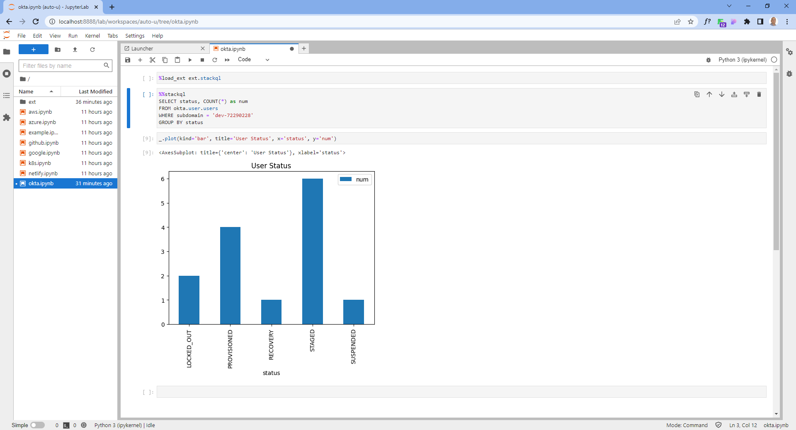

[](https://stackql.io/)  
<br />
[](https://github.com/stackql/stackql-jupyter-base/actions/workflows/main.yml)


# StackQL Jupyter Base Image

Base template repository to create a StackQL analytics notebook Docker container image including StackQL, Jupyter and Python (including `pandas`).  



This image also includes the StackQL Jupyter magic extension to allow StackQL queries to be executed directly from a Jupyter notebook cell, for instance:  

```jupyter
%%stackql
SELECT instanceState, COUNT(*) as num_instances 
FROM aws.ec2.instances 
WHERE region = '$region' GROUP BY instanceState
```

> Use StackQL to query cloud inventory and perform analysis and visualisations for security analysis, cost management and optimization, and for cloud automation and provisioning.  For more information see the [StackQL documentation](https://stackql.io/docs).

# Usage

This repository builds and publishes the [__stackql/stackql-jupyter-base__](https://hub.docker.com/r/stackql/stackql-jupyter-base) image to DockerHub.  This image is used by the [__stackql-notebook__](https://github.com/stackql/stackql-notebook) template repository to create StackQL analytics notebook instances.

# Build locally

```
docker build --no-cache -t stackql-jupyter-base .
```
